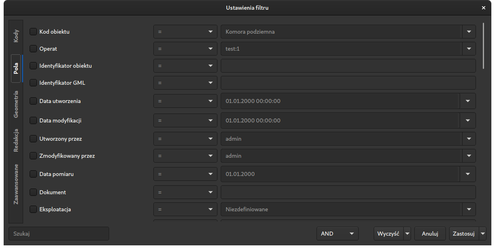

# EW-Database
Narzędzia umożliwiające zaawansowane operacje i analizę baz danych programu EW-Mapa.

### Masowa edycja obiektów
Istnieje możliwość masowej edycji wybranych obiektów - przypisywanie wartości dla wybranych atrybutów. Dodatkowo istnieje możliwość edycji obiektów poprzez przypisanie atrybutu na podstawie pliku wsadowego (np. przypisanie daty pomiaru na podstawie operatu).

### Tworzenie relacji pomiędzy obiektami
Możliwość tworzenia relacji pomiędzy obiektami obejmuje tworzenie relacji pomiędzy obiektami punktowymi, liniowymi i powierzchniowymi. W przypadku obiektów punktowych należy ustalić maksymalną dopuszczalną odległość pomiędzy obiektami. Dla obiektów liniowych należy ustalić maksymalną dopuszczalną odległość obiektu od linii (obiekt nie musi znajdować się w pobliżu punktu załamania obiektu liniowego). Dla obiektów powierzchniowych relacja tworzona jest w przypadku, gdy obiekt znajduje się wewnątrz obszaru obiektu powierzchniowego.

W ramach tworzenia relacji pomiędzy obiektami możliwa jest też zamiana etykiet punktów wysokościowych będących podobiektami przewodów giętkich tak, aby wyświetlane wysokości były podawane z precyzją do decymetra (zgodnie z obowiązującym rozporządzeniem).

Relacje tworzone są poprawnie z uwzględnieniem priorytetu obiektu (np. rzędna wysokościowa znajdująca się zarówno na włazie, jak i na komorze podziemnej, zostanie przypisana do komory), a także redakcji rzędnych (rzędna obrócona zgodnie z kierunkiem sieci zostanie przypisana w pierwszej kolejności do osi przewodu, a nie do urządzenia).

### Poprawa segmentacji obiektów
Istnieje możliwość dostosowania segmentacji obiektów do obowiązującego rozporządzenia. Narzędzie umożliwia podział obiektów liniowych w miejscach styku więcej niż dwóch obiektów liniowych. W przypadku, gdy nie istnieje punkt załamania w miejscu styku obiektów, zostanie on poprawnie wygenerowany.

Istnieje także możliwość usunięcia nadmiernej segmentacji zgodnie z rozporządzeniem (tj. segmentacja następuje w chwili zmiany wybranych atrybutów lub w miejscu styku więcej niż dwóch obiektów liniowych, obiekty tego samego rodzaju segmentują się wzajemnie, obiekty tej samej lub wyższej funkcji segmentują obiekty tej samej lub niższej funkcji, obiekty wyższej funkcji nie segmentują obiektów niższej funkcji). W praktyce oznacza to, że dla obiektów z poprawnie pozyskanymi atrybutami i funkcjami, segmentacja zostaje wykonana zgodnie z obowiązującymi przepisami. Istnieje także możliwość ustalenia, czy zmiana operatu powinna segmentować obiekt, czy nie (rozporządzenie stanowi, że zmiana operatu nie segmentuje obiektu - ze względów praktycznych zamawiający decydują się często na segmentacje podczas zmiany operatu).

### Harmonizacja geometrii obiektów
Istnieje możliwość dopasowania geometrii wybranych obiektów do istniejącej geometrii innych obiektów. Narzędzie to umożliwia na przykład ujednolicenie geometrii osi przewodów z geometrią budynków (dociągnięcie punktu styku osi przewodu do krawędzi budynku). Narzędzie znajduje także zastosowanie przy ujednolicaniu geometrii linii napowietrznych z wprowadzonymi słupami (dociągnięcie punktów załamania linii do centrum słupa). Ponadto istnieje możliwość wstawienia punktów załamania osi przewodów w miejscu wstawienia armatury lub punktów wysokościowych.

### Automatyczna redakcja i tworzenie opisów
Możliwe jest obliczenie kąta obrotu i ustalenie justyfikacji dla opisów punktów wysokościowych powiązanych z osiami przewodów w taki sposób, że opisy będą obrócone zgodnie z kierunkiem sieci oraz zostaną nałożone na oś sieci wraz z poprawną justyfikacją.

Dla obiektów liniowych istnieje możliwość stworzenia opisów wraz z ustaleniem minimalnej długości osi oraz powtarzaniem etykiety co zadaną odległość. Dodatkowo, dla istniejących opisów, istnieje możliwość nasunięcia ich na oś przewodu i dopasowanie kąta obrotu do kierunku osi.

W przypadku obiektów punktowych i powierzchniowych istnieje możliwość wygenerowania etykiety obiektów w określonym punkcie mierzonym względem punktu wstawienia symbolu lub centroidu obiektu.

### Zmiana kodu obiektów
Istnieje możliwość zmiany kodu dla wybranych obiektów wraz z przeniesieniem segmentów, symboli i opisów obiektu na odpowiednie warstwy.

### Przypisywanie operatu dla obiektów
W przypadku gdy zamawiający nie życzy sobie aby zmiana operatu elementów liniowych segmentowała obiekt istnieje potrzeba wyboru najnowszego operatu dla obiektu spośród operatów elementów tworzących obiekt. Narzędzie umożliwia taką operację biorąc pod uwagę rocznik operatu. Możliwe jest także ustalenie najnowszego operatu na podstawie pliku z wykazem dat pomiaru dla wybranych operatów.

Dodatkowo możliwe jest zastąpienie operatu elementów obiektu operatem przypisanym do obiektu - podczas edycji obiektu operat zostaje przypisany jedynie obiektowi, a elementy warstw zachowują oryginalny operat, co bywa nieporządane.

### Tworzenie listy możliwych błędów
Istnieje możliwość przeprowadzania zaawansowanych analiz geometrycznych i logicznych dla istniejących obiektów. W przypadku podejrzenia wystąpienia błędu (np. wstawienie kilku punktów wysokościowych w jednym miejscu, pozyskanie zbyt długiego segmentu linii napowietrznej niskiego napięcia itd.) istnieje możliwość wygenerowania listy obiektów, w których kartowaniu prawdopodobnie  popełniono błąd.

## Interfejs

