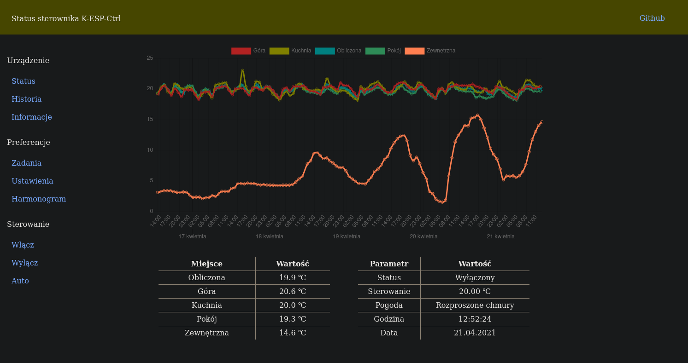
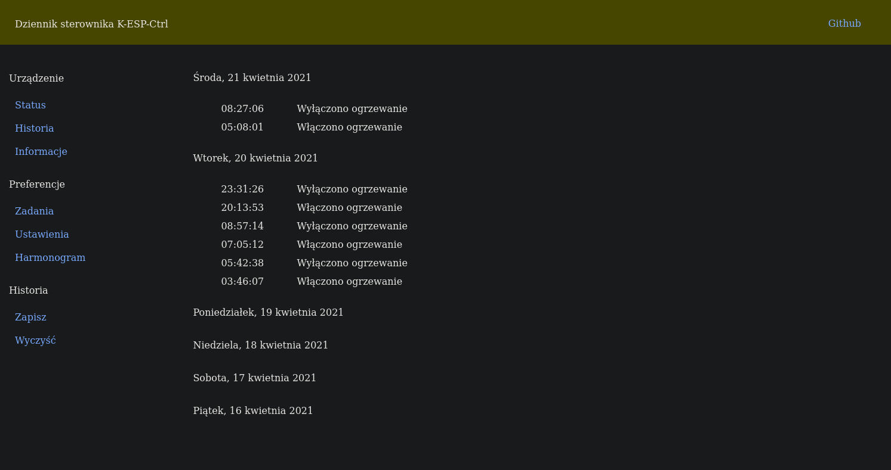
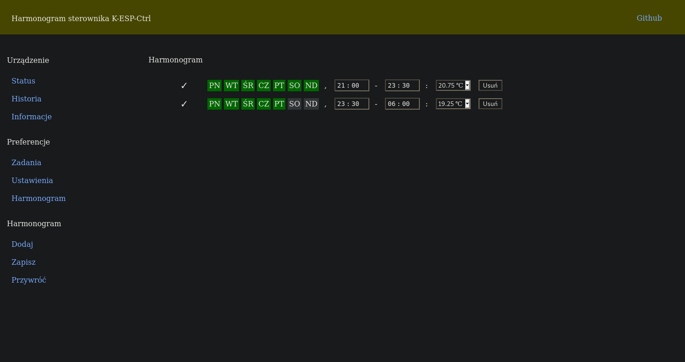
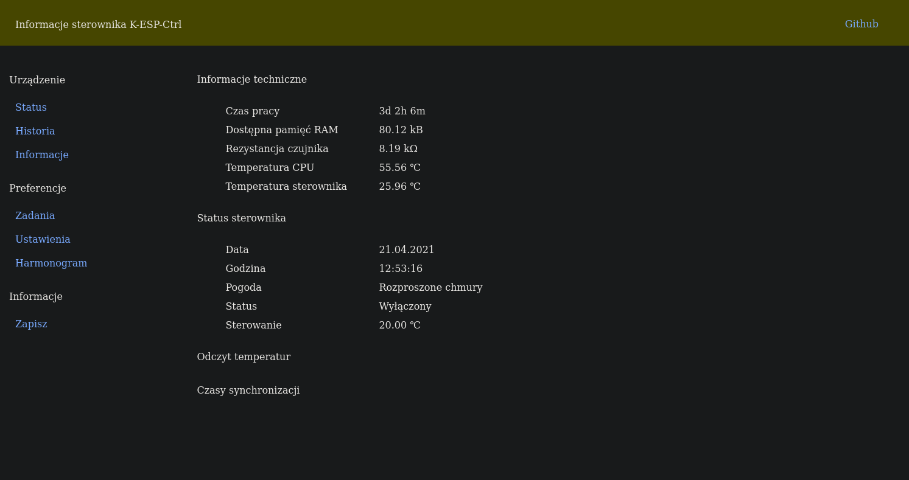
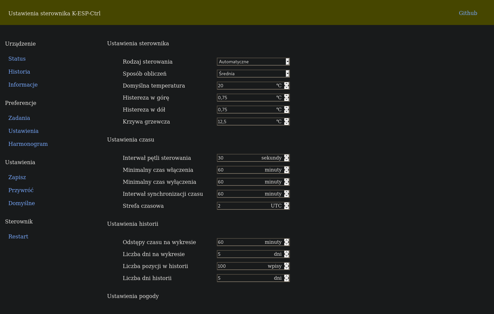
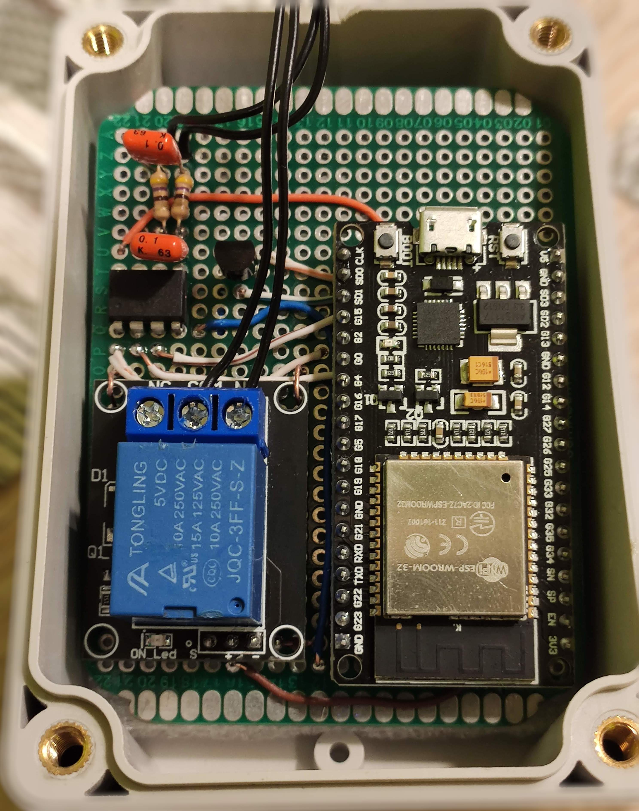
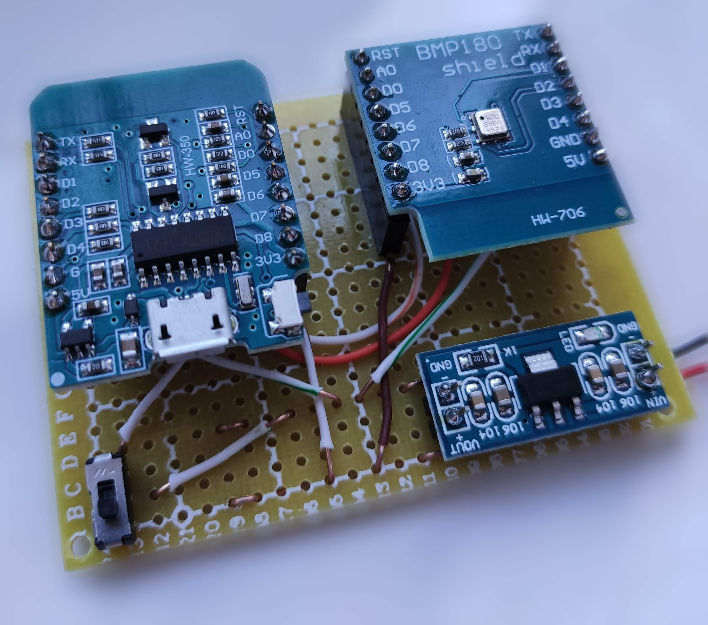

# K-ESP-CTRL

Sterownik centralnego ogrzewania oparty o ESP32 i język micropython.

### Możliwości

- Interfejs HTTP umozliwiający podgląd stanu urządzenia i sterowanie urządzeniem
- Sterowanie kotłem (dwustanowe) wraz z pętlą histerezy i minimalnym czasem trwania stanu sterowania
- Symulacja rezystancji czujnika zewnętrznego (funkcja pogodowa kotła) na podstawie temperatury zewnętrznej
- Wyznaczanie temperatury na podstawie wzkazań rozproszonych czujników pomiarowych (dowolna liczba)
- Monitorowanie historii rejestrowanych temperatur oraz temperatury zewnętrznej
- Możliwość ustalenia dowolnej liczby konfiguracji temperatury zadanej w zależności od dnia/godziny
- Możliwość dodawania jednorazowych zdarzeń w określonym czasie
- Klient sieci WiFi lub punkt dostępowy WiFi (zależnie od konfiguracji)
- Autoryzacja użytkowników (dowolna liczba użytkowników wraz z hasłem)

### Sprzęt

- ESP32 lub ESP8266 (zalecane ESP32 dla szybszej obsługi interfejsu HTTP)
- MCP41100 lub ekwiwalent (w celu symulacji zewnętrznego czujnika temperatury)
- LM35 (opcjonalnie w celu kontroli temperatury wewnątrz sterownika)
- Filtr RC (w celu wygładzenia wyjścia z potencjometru cyfrowego)
- Przekaźnik 2 pozycyjny (w celu zadawania sygnału sterującego)

### Ustawienia

- Rodzaj sterowania
  - Automatyczne
  - Ręczne
- Sposób obliczania temperatury
  - Średnia
  - Mediana
  - Maksimum
  - Minimum
- Ustawienia sterowania
  - Domyślna temperatura zadana
  - Histereza (w górę i w dół)
  - Parametry krzywej grzewczej kotła
  - Interwał pętli sterowania
  - Minimalny czas cyklu włączenia/wyłączenia
- Ustawienia czasu
  - Interwał synchronizacji czasu s serwerem MTP
  - Strefa czasowa (czas zapisywany w UTC)
- Uwstawienia wykresu temperatur
  - Odstępy czasu na wykresie
  - Liczba dni na wykresie
- Ustawienia historii
  - Liczba pozycji w historii
  - Liczba dni w historii
- Ustawienia danych pogodowych
  - Token OpenWeatherMap
  - Lokalizacja sterownika

### Zależności

- [Micropython](https://micropython.org/)
- [Chart.js](https://www.chartjs.org/)
- [Moment.js](https://momentjs.com/)
- [jQuery](https://jquery.com/)

## Galeria

### Interfejs

### Urządzenie

